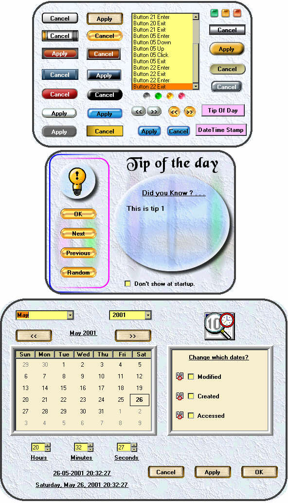



## Windows Blinds skinned rollover\(hover\) buttons, TipofDay, Date Time Stamp

### Description

Update 27-May-2001. Use these Windows Blinds, Adobe, & Neoplanet style skinned rollover (hover) buttons to brighten up your GUI. Button control by J. Pearson (Aug 2000 PSC). Hint: Put bmp's in resource file and load them into buttons at run-time in Form_Load. TipofDay & DateTimeStamp forms shows how this is done.
 
### More Info
 

             |
---                |---
**Submitted On**   |2001-05-28 23:10:32
**By**             |[Dana Seaman\_](https://github.com/Planet-Source-Code/PSCIndex/blob/master/ByAuthor/dana-seaman.md)
**Level**          |Intermediate
**User Rating**    |4.7 (238 globes from 51 users)
**Compatibility**  |VB 4\.0 \(32\-bit\), VB 5\.0, VB 6\.0
**Category**       |[Custom Controls/ Forms/  Menus](https://github.com/Planet-Source-Code/PSCIndex/blob/master/ByCategory/custom-controls-forms-menus__1-4.md)
**World**          |[Visual Basic](https://github.com/Planet-Source-Code/PSCIndex/blob/master/ByWorld/visual-basic.md)
**Archive File**   |[Windows Bl201895282001\.zip](https://github.com/Planet-Source-Code/dana-seaman-windows-blinds-skinned-rollover-hover-buttons-tipofday-date-time-stamp__1-23213/archive/master.zip)

